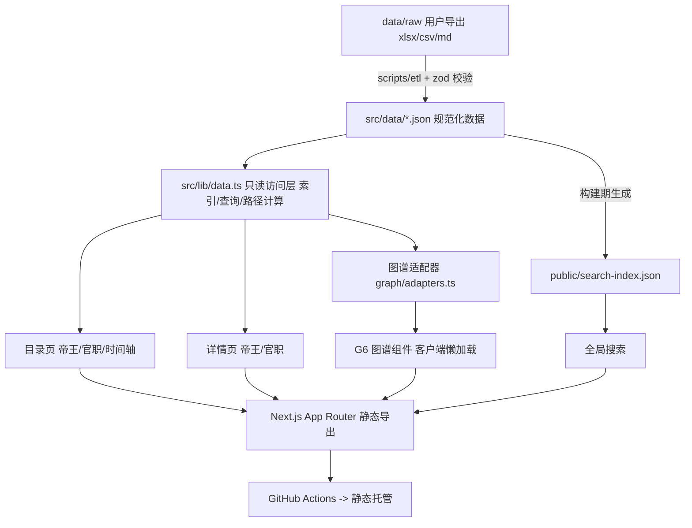

## 产品概述
基于「明朝帝王世系 & 官职品级」文档（金山文档，用户导出至工作区）构建一个中文古典风格的静态知识站。以「目录式浏览」为主干，让用户快速查到任意皇帝或官职；以「关系图谱」为增强，用可视化交互讲清血缘继统与官僚品级两套体系之间的结构关系。

## 核心功能
- **帝王目录**：16 帝（含建文、景泰、崇祯，可扩展南明）按世系/时间轴双视图浏览，含庙号、谥号、姓名、年号、生卒、在位起止、陵寝、前任继任。
- **帝王详情**：单帝档案页 + 亲属关系卡（父/母/子/兄弟）+ 重大事件 + 在位年号 + 图谱入口（以该帝为中心高亮祖先—后代路径）。
- **官职品级目录**：九品十八级（正/从一品至正/从九品 + 未入流）按「品级」与「衙门」双维度浏览，支持中央/地方、文/武、官职名筛选。
- **官职详情**：品级、所属衙门、职掌、俸禄、沿革、现代近似职能、相关人物。
- **关系图谱（G6）**：
  - 世系图：树图 / 紧凑树 / 力导向布局切换，支持缩放、拖拽、折叠展开、关系类型（父子/兄弟/叔侄/祖孙/继统）过滤；
  - 官职体系图：品级—衙门—官职的层级拓扑；
  - 列表与图谱双向联动，点击节点跳转详情页。
- **全局检索**：跨帝王、官职、年号、事件的即时搜索。
- **关于 / 数据来源**：说明数据出处、校正方式与贡献流程。

## 边界与前提
- 文档内容我无法直接读取（需登录），因此首版以「可替换 schema + 种子数据」实现全链路，用户导出 Excel/CSV/Markdown 到 `data/raw/` 后用 ETL 脚本灌入真实数据并校验。
- 本期为纯前端静态站，无服务端与数据库；后期可平滑演进到 API + DB。


## 技术栈选型

| 层 | 选择 | 理由与权衡 |
|---|---|---|
| 框架 | **Next.js 15（App Router，React 19）** | 目录页需要 SEO 与可被搜索引擎收录；`output: 'export'` 全静态导出，可部署 Vercel / GitHub Pages / 任意静态托管，零运维 |
| 语言 | **TypeScript 5（strict）** | 历史数据字段多、关系复杂，类型 + 运行时校验能挡住数据错误 |
| 样式 | **Tailwind CSS v4** + shadcn/ui（Radix 底座） | v4 用 `@theme` 在 CSS 中定义设计令牌，便于中文古典配色与暗色模式；shadcn 提供可复制可控的基础组件（Dialog/Command/Tabs/Select），无运行时锁定 |
| 图谱 | **AntV G6 v5** | 中文文档与示例全，内置 tree / compactBox / force / radial 布局、鱼骨与边绑定，适合家谱树与官职拓扑；对比 Cytoscape（树布局弱）、D3 自研（工作量大）、ECharts（交互定制受限） |
| 搜索 | 首版自研轻量索引（分词 + 倒排，构建期生成 `search-index.json`） | 纯静态无服务端；数据量仅数百条，体积 < 200KB，无需引入 FlexSearch / SQLite-WASM |
| 数据校验 | **zod** + ETL 脚本 | 在构建前校验 JSON/json 产物，字段缺失与关系悬空引用直接报错 |
| 工程 | **pnpm** + ESLint + Prettier + GitHub Actions | Node v24.5.0 / pnpm 11.21.0 已就绪；CI 跑 lint、typecheck、`data:check`、`next build` 后发布静态产物 |

## 实现方案

**总体策略**：数据先行的静态站点。先定义领域模型（types + zod），再写 ETL 与种子数据，随后按「目录浏览 → 详情 → 图谱」顺序构建页面，最后打磨视觉与文档。

**关键决策**
1. **数据与代码分离**：`data/raw/` 存放用户导出的原始文件（不进构建产物），`src/data/*.json` 为规范化产物，ETL 脚本单向生成，便于用户后续校正重跑。
2. **关系独立建模**：关系（relations）不内嵌在实体里，而是一等公民边表 `{id, from, to, type, note, startYear, endYear}`，这样同一套数据可同时驱动树图、力导向图与「祖先—后代路径」计算，避免树形结构无法表达兄弟/叔侄/继统的问题。
3. **图谱按需加载**：G6 体积较大，仅在图谱路由通过 `next/dynamic({ ssr: false })` 懒加载；桌面端渲染 Canvas 图谱，移动端（<768px）降级为可折叠树列表，保证性能与可用性。
4. **静态导出的限制与对策**：不使用 ISR / Route Handler；详情页用 `generateStaticParams` 预渲染；交互筛选全部走客户端状态与 URL query（可分享、可回退）。
5. **性能**：图文数据总量小（数百节点），图谱渲染为唯一热点——通过节点懒渲染、边类型过滤后重建子图、避免每次 hover 触发全图重绘（仅改样式）来控制；搜索索引构建期生成，运行时只做倒排合并。

**复杂度与瓶颈**：世系路径查询为 O(V+E) 的 BFS/DFS；品级筛选为 O(n) 线性过滤；首屏由静态 HTML 直出，图谱 JS 为延迟加载，不影响 LCP。

## 实现注意事项
- 图谱组件必须 `ssr: false` 且卸载时 `graph.destroy()`，防止 G6 在 StrictMode 双挂载下重复渲染与内存泄漏。
- 「正/从品级」排序不可用字符串比较，需 `(rank, isSecondary)` 数值键排序。
- 关系边的 `from/to` 必须在构建期校验为存在实体，否则图谱会丢节点。
- 数据未校正前，UI 需显式标注「史料待校正」，避免以讹传讹。
- 保持向后兼容：新增字段一律可选，schema 校验只拒绝缺失必填项。

## 架构设计



**模块划分**
- **数据层**：types + zod schema + JSON + ETL 脚本，单一数据源，其他层只读。
- **访问层（lib/data.ts）**：提供 `getEmperors()`、`getEmperor(id)`、`getOfficialsByRank()`、`getAncestorPath()` 等纯函数，带构建期缓存（模块级 Map），页面与图谱共用，避免重复遍历。
- **展示层**：目录组件、详情组件、图谱组件、搜索组件，均为展示型组件，不含数据获取逻辑。
- **图谱适配器**：把领域实体 + 关系边转换成 G6 的 `{nodes, edges}` 与布局配置，隔离「业务模型」与「G6 API」，便于后续换库。

## 目录结构

```
ming-dynasty/
├── README.md                     # [NEW] 项目简介、快速开始、数据规范、目录说明、数据校正流程
├── ROADMAP.md                    # [NEW] 五阶段开发路线图与验收标准
├── CONTRIBUTING.md               # [NEW] 数据校正与贡献指南
├── package.json                  # [NEW] pnpm scripts: dev/build/lint/typecheck/data:import/data:check
├── next.config.ts                # [NEW] output:'export'、images.unoptimized、trailingSlash
├── tsconfig.json / eslint.config.mjs / postcss.config.mjs / .prettierrc
├── .github/workflows/deploy.yml  # [NEW] lint+typecheck+data:check+build，发布 out/ 到 Pages
├── data/
│   ├── README.md                 # [NEW] 原始文件放置说明与字段对照表
│   └── raw/                      # [NEW] 用户导出的 xlsx/csv/md（等待放入，不手写）
├── scripts/
│   ├── etl/parse-raw.ts          # [NEW] 解析 xlsx/csv，按字段映射表转为中间结构
│   ├── etl/build-json.ts         # [NEW] 中间结构 + zod 校验 -> src/data/*.json
│   ├── etl/build-relations.ts    # [NEW] 由亲属/继统字段推导关系边并去重
│   ├── etl/build-search-index.ts # [NEW] 生成 public/search-index.json
│   └── check-data.ts             # [NEW] 数据一致性检查：悬空引用、品级合法性、时间区间
├── src/
│   ├── types/index.ts            # [NEW] Emperor / OfficialPost / Relation / Era / Event 类型
│   ├── types/schemas.ts          # [NEW] zod schema，ETL 与运行时共用
│   ├── data/*.json               # [NEW] emperors / officials / relations / eras / events / meta（种子版，可替换）
│   ├── lib/data.ts               # [NEW] 只读数据访问与查询（模块级缓存）
│   ├── lib/graph/adapters.ts     # [NEW] 领域数据 -> G6 nodes/edges/布局配置
│   ├── lib/graph/path.ts         # [NEW] 祖先—后代路径、子树、邻居计算
│   ├── lib/search.ts             # [NEW] 倒排索引加载与检索（支持拼音/别名）
│   ├── lib/seo.ts                # [NEW] metadata / OG / JSON-LD 构造
│   ├── app/layout.tsx            # [NEW] 全局壳：顶栏、暗色模式、字体、SEO
│   ├── app/page.tsx              # [NEW] 首页：概览 + 双入口 + 统计
│   ├── app/emperors/page.tsx     # [NEW] 帝王目录（世系/时间轴双视图 + 筛选）
│   ├── app/emperors/[id]/page.tsx# [NEW] 帝王详情（generateStaticParams 预渲染）
│   ├── app/officials/page.tsx    # [NEW] 官职品级目录（按品级/按衙门双视图）
│   ├── app/officials/[id]/page.tsx # [NEW] 官职详情
│   ├── app/graph/page.tsx        # [NEW] 图谱总入口（世系 / 官职 切换）
│   ├── app/search/page.tsx       # [NEW] 全局搜索结果页
│   ├── app/about/page.tsx        # [NEW] 数据来源与校正说明
│   ├── components/               # [NEW] layout/ emperor/ official/ graph/ search/ ui(shadcn)
│   └── app/globals.css           # [NEW] Tailwind v4 @theme 设计令牌、宣纸质感、暗色变量
└── public/                       # [NEW] favicon、OG 图、search-index.json
```

## 关键数据结构

```ts
// src/types/index.ts（精简示意，字段可扩展）
export type RelationType = 'father_son' | 'brother' | 'uncle_nephew' | 'grandparent' | 'succession' | 'spouse' | 'holds_post';

export interface Emperor {
  id: string;            // 稳定 slug，如 'hongwu'
  name: string;          // 朱元璋
  templeName?: string;   // 庙号：太祖
  posthumousName?: string;// 谥号
  eraNames: string[];    // 年号：洪武
  birthYear?: number; deathYear?: number;
  reignStart?: number; reignEnd?: number;
  mausoleum?: string;
  summary: string;
  events?: string[];     // 关联事件 id
}

export interface OfficialPost {
  id: string; name: string;
  rank: 1 | 2 | 3 | 4 | 5 | 6 | 7 | 8 | 9;   // 品级
  secondary: boolean;                         // 是否为「从」品
  department?: string;                        // 所属衙门：吏部/都察院/布政使司...
  scope?: 'central' | 'local';
  category?: 'civil' | 'military';
  duty?: string;   salary?: string;  modernAnalogy?: string;
  note?: string;
}

export interface Relation {
  id: string; from: string; to: string;  // 实体 id（emperor / post / person）
  type: RelationType; label?: string; startYear?: number; endYear?: number;
}
```

## Roadmap（写入 ROADMAP.md）

| 阶段 | 目标 | 产出与验收 |
|---|---|---|
| P0 脚手架 | 初始化 Next.js 15 + TS + Tailwind v4 + shadcn + ESLint/Prettier + CI | `pnpm dev` 可跑、`pnpm build` 出 `out/` |
| P1 数据层 | types + zod + 种子数据（16 帝 + 九品十八级骨架）+ ETL 脚本 + `data:check` | 无真实数据时全站可跑；放入 `data/raw/` 后 `pnpm data:import` 可一键替换 |
| P2 目录浏览 | 首页、帝王目录/详情、官职目录/详情、时间轴、全局搜索 | 全部路由静态导出成功，详情页可被搜索引擎收录 |
| P3 图谱交互 | G6 世系图（树/紧凑树/力导向）、官职体系图、路径高亮、类型过滤、列表联动 | 桌面端交互流畅，移动端有降级方案 |
| P4 打磨与文档 | 暗色模式、a11y、OG/SEO、性能与数据校正流程、README/ROADMAP/CONTRIBUTING | Lighthouse ≥ 90、无悬空引用、文档齐全 |


## 设计风格
中文古典雅致风：宣纸底 + 朱红/青黛点缀 + 墨色正文，并以宋体字族承载历史厚重感；卡片采用细描金边与极淡投影，营造「线装书/奏折」的质感，暗色模式切换为「夜读」墨蓝底。整体留白充足、层级清晰，克制的微动效（渐显、下划线展开、图谱节点悬停发光）让界面有生气而不喧宾夺主。

## 页面规划（6 屏）
1. **首页**：顶部导航 + Hero（明朝 276 年概览与关键统计）+ 双入口大卡（帝王世系 / 官职品级）+ 「关系图谱」推荐位 + 页脚数据来源说明。
2. **帝王目录**：左侧筛选（朝代分期/在位时长/是否有庙号），主区「世系视图」与「时间轴视图」切换，卡片含庙号、姓名、年号、在位年份，悬停显示父子关系。
3. **帝王详情**：顶部皇帝名号与生卒在位；主体为档案信息卡 + 关系卡（父/母/子/兄弟/前任/继任，可点击跳转）+ 年号与大事记；底部内嵌「以我为中心」的迷你世系图，点击展开全屏图谱。
4. **官职品级目录**：顶部九品十八级色阶导航条；「按品级」阶梯列表与「按衙门」分组树两种视图切换；筛选（中央/地方、文/武、关键词）。
5. **官职体系图谱**：品级—衙门—官职三层拓扑图（G6），支持层级展开/收起、按品级过滤，右侧抽屉展示选中官职详情并支持跳详情页。
6. **关系图谱（世系）**：全屏图谱主屏，顶部工具栏切换布局（树图/紧凑树/力导向）与关系类型过滤，点击节点高亮祖先—后代路径，右侧信息面板 + 底部时间轴联动。

## 通用组件
- 顶部导航栏：站点标识、主导航（帝王/官职/图谱/搜索）、搜索入口、暗色切换；滚动后收窄并加毛玻璃。
- 底部页脚：数据来源、校正反馈入口、开源信息。
- 图谱工具栏与信息抽屉为跨页面复用组件。

## 响应式
桌面端三栏/两栏信息密度高；平板降为单栏卡片流；移动端图谱降级为可折叠树 + 分层筛选，导航收为抽屉菜单。

## Agent Extensions
### Skill
- **project-structure**
  - Purpose: 在 P0/P1 阶段校验并最终确定目录组织方式（数据层 `src/data` 与页面层 `src/app` 的职责边界、ETL 脚本位置、组件分层），避免目录反模式
  - Expected outcome: 产出与项目规模匹配的、可长期演进的目录结构，且各文件职责清晰、无跨层耦合
